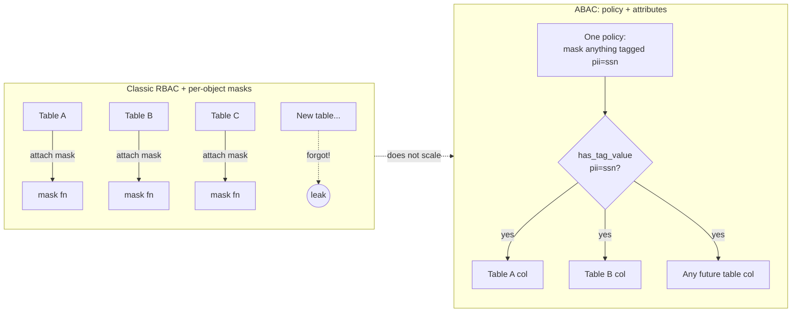
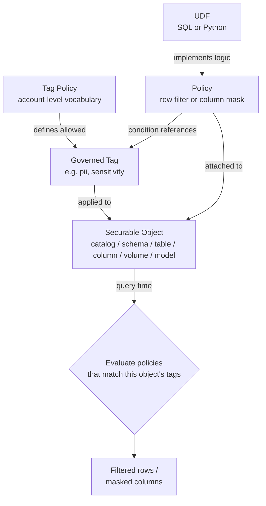
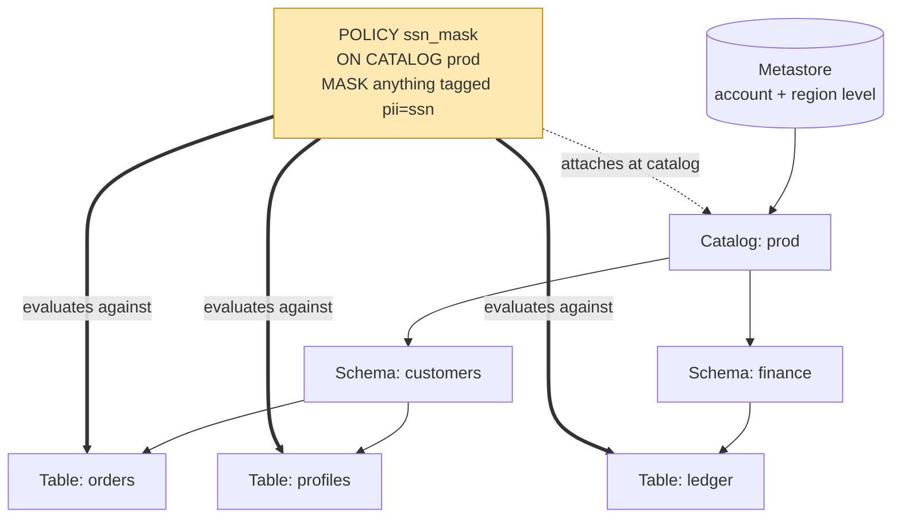
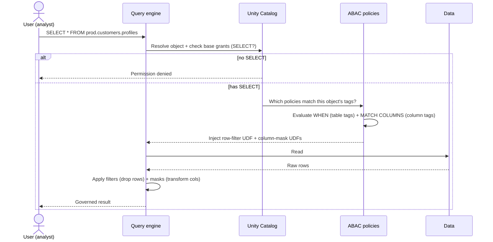
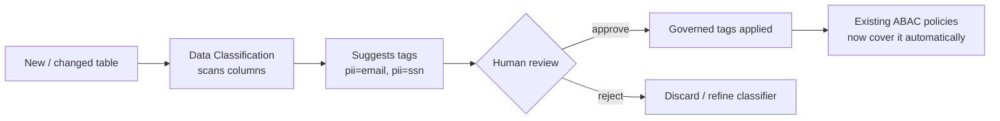
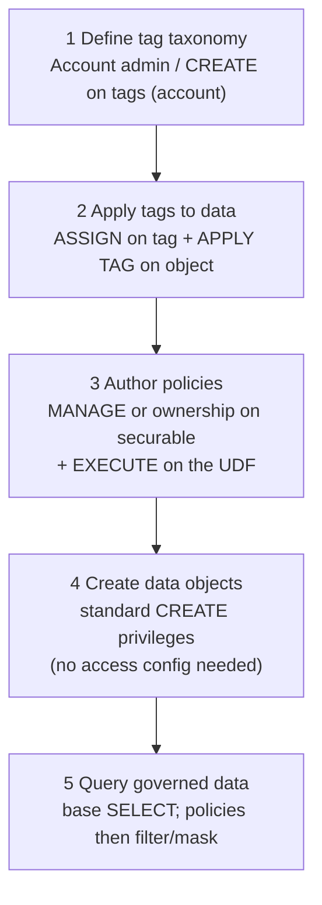
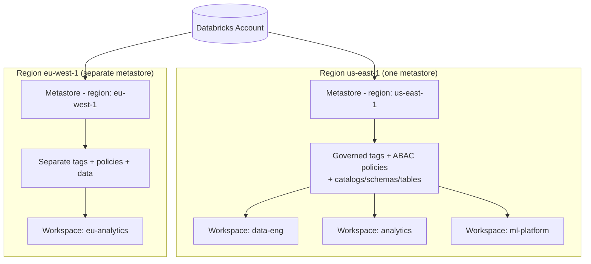
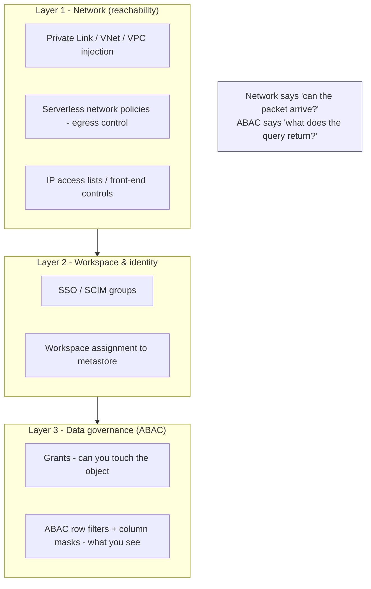
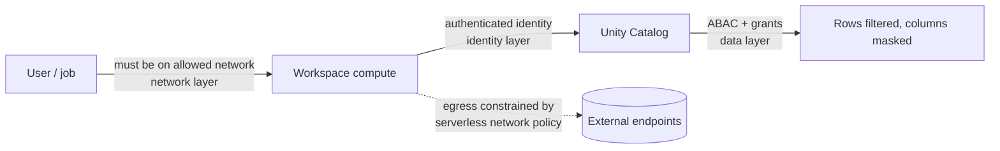

# Attribute-Based Access Control (ABAC) in Databricks Unity Catalog

> A deep, practical explanation of how ABAC works in Databricks, why it matters,
> how it behaves across workspaces, where network segmentation fits, and where the
> sharp edges are.

---

## TL;DR

**ABAC (Attribute-Based Access Control)** lets you govern *what data people can see*
by attaching **policies** to **attributes** (governed tags) instead of writing
grants table-by-table. You tag your data once ("this column is `pii=ssn`", "this
table is `sensitivity=high`"), write a small number of policies that say *"mask
anything tagged `pii=ssn` for everyone except HR admins"*, and Unity Catalog
enforces those rules **dynamically and automatically** across every catalog,
schema, and table that matches — including tables that don't exist yet.

It is the difference between **governance by configuration** (ABAC) and
**governance by repetition** (classic per-object grants and per-table masks).

ABAC became **generally available** in Unity Catalog in late 2025, together with
**Governed Tags** and **agentic Data Classification**.

---

## 1. Why ABAC exists: RBAC vs. ABAC

Traditional access control in a lakehouse is **role-based (RBAC)** plus
**per-object grants**: you `GRANT SELECT ON TABLE ... TO group`, and if a table has
sensitive columns you attach a row filter or column mask function *to that specific
table*. This works, but it does not scale:

- Every new table needs the same masks re-attached. Miss one → a leak.
- A change in policy ("now mask phone numbers too") means editing hundreds of tables.
- Enforcement depends on humans remembering to do it consistently.

**ABAC inverts the model.** Instead of binding rules to *objects*, you bind rules to
*attributes*, and let the platform find every object that has the attribute.



| Dimension | RBAC / per-object | ABAC |
|---|---|---|
| Unit of control | The object (table/column) | The attribute (tag) |
| New data | Must be configured manually | Governed automatically if tagged |
| Policy change | Edit every object | Edit one policy |
| Failure mode | Silent omission → leak | Mis-tagging → wrong policy applies |
| Scales to | Tens of tables comfortably | 10,000+ policies / metastore |

> 📷 *Figure: The Unity Catalog "Governance" tab where tags, policies, and
> classifications are managed in one place.*
> See the [GA announcement blog](https://www.databricks.com/blog/abac-row-filtering-and-column-masking-policies-governed-tags-and-data-classification-are-now)
> for the product screenshots.

---

## 2. Core building blocks

ABAC is built from four concepts that snap together:



### 2.1 Governed tags

**Governed tags** are key–value pairs **defined at the account level** and applied to
Unity Catalog securables (catalogs, schemas, tables, **columns**, volumes, models).
"Governed" means the *vocabulary itself is controlled* by a **tag policy** — you can
restrict which keys exist and which values are allowed (e.g. `sensitivity` may only
be `low | medium | high`). This prevents the tag sprawl that makes free-form tagging
useless for security.

**Inheritance rule (important):** tags propagate *down* the hierarchy — a securable
inherits tags from its parent catalog or schema, and a child can override an inherited
tag. **The one exception is columns: column tags do _not_ inherit from the parent
table and must be applied directly.**

### 2.2 Policies

A **policy** is the rule. Two enforcement policy types are GA, plus a beta type:

- **Row filter policy** — restricts *which rows* a user can see. Backed by a UDF that
  returns `BOOLEAN`; rows where it returns `FALSE` are dropped.
- **Column mask policy** — controls *what a column value looks like*. Backed by a UDF
  that takes the column value and returns the original or a masked version.
- **GRANT policy (Beta)** — dynamically grants a privilege when a tag condition matches
  (used e.g. for model execution). Unlike the others, it does **not** use a UDF.

### 2.3 Policy conditions (the matching logic)

Conditions are expressed with two built-in functions:

- `has_tag('key')` → true if the object has that tag key.
- `has_tag_value('key', 'value')` → true if the object has that key set to that value.

These appear in two places in a policy:

- `WHEN` — evaluated against the **object's** tags (does this table qualify?).
- `MATCH COLUMNS` — evaluated against **column** tags only (which columns to act on).
  Note: inside `MATCH COLUMNS`, `has_tag` checks *column* tags and **does not** match
  table tags. A policy may include **up to 3 column expressions**, combined with **AND**.

### 2.4 UDFs

Row filters and masks delegate the actual logic to **user-defined functions**. SQL
UDFs are preferred because the optimizer can inline them; Python UDFs registered in
Unity Catalog are supported but **cannot be inlined or optimized**, so they cost more.

---

## 3. The Unity Catalog hierarchy and where policies attach

Policies attach with the `ON` clause and then **cascade down the hierarchy**:

- `ON CATALOG c` → evaluated against every table in catalog `c`.
- `ON SCHEMA c.s` → every table in that schema.
- `ON TABLE c.s.t` → only that table.

Databricks recommends **attaching at the highest practical level (usually the
catalog)** so coverage is maximal and a new schema/table is governed the moment it
is created and tagged.



Scope support differs by type: row-filter/column-mask policies can attach at
`CATALOG`, `SCHEMA`, or `TABLE`; GRANT policies only at `CATALOG` or `SCHEMA`.

---

## 4. Policies in practice (real SQL)

The DDL is `CREATE [OR REPLACE] POLICY`. Full shape:

```sql
CREATE [ OR REPLACE ] POLICY policy_name
ON { CATALOG catalog_name | SCHEMA schema_name | TABLE table_name }
[ COMMENT description ]
{ row_filter_body | column_mask_body }

-- row_filter_body:
--   ROW FILTER function_name
--   TO principal [, ...] [ EXCEPT principal [, ...] ]
--   FOR TABLES
--   [ WHEN condition ]
--   [ MATCH COLUMNS condition [ AS alias ] [, ...] ]
--   [ USING COLUMNS ( function_arg [, ...] ) ]

-- column_mask_body:
--   COLUMN MASK function_name
--   TO principal [, ...] [ EXCEPT principal [, ...] ]
--   FOR TABLES
--   [ WHEN condition ]
--   [ MATCH COLUMNS condition [ AS alias ] [, ...] ]
--   ON COLUMN alias
--   [ USING COLUMNS ( function_arg [, ...] ) ]
```

### 4.1 Column mask example — mask SSNs everywhere

```sql
-- 1. The masking logic (reusable UDF)
CREATE FUNCTION ssn_to_last_nr(ssn STRING, nr INT) RETURNS STRING
  RETURN right(ssn, nr);

-- 2. One policy governs the WHOLE catalog
CREATE POLICY ssn_mask
  ON CATALOG employees
  COLUMN MASK ssn_to_last_nr
  TO `All Users` EXCEPT `HR admins`     -- everyone is masked except HR admins
  FOR TABLES
  MATCH COLUMNS has_tag('ssn') AS ssn   -- find columns tagged 'ssn'
  ON COLUMN ssn                          -- apply mask to that column
  USING COLUMNS (4);                     -- pass nr=4 -> show last 4 digits
```

Any column in any table in `employees` tagged `ssn` is now masked to its last 4
digits for everyone except HR admins — including columns added next year.

### 4.2 Row filter example — regional data residency

```sql
CREATE FUNCTION non_eu_region(geo_region STRING) RETURNS BOOLEAN
  RETURN geo_region <> 'eu';

CREATE POLICY hide_eu_customers
  ON SCHEMA prod.customers
  COMMENT 'Hide EU customers from analysts on high-sensitivity tables'
  ROW FILTER non_eu_region
  TO analysts
  FOR TABLES
  WHEN has_tag_value('sensitivity', 'high')   -- only on high-sensitivity tables
  MATCH COLUMNS has_tag('geo_region') AS region
  USING COLUMNS (region);                       -- feed the region column to the filter
```

### 4.3 Managing policies

There is **no `ALTER POLICY`** — change a policy with `CREATE OR REPLACE POLICY`.
Inspect and remove with:

```sql
SHOW POLICIES ON TABLE prod.customers.profiles;
DESCRIBE POLICY hide_eu_customers;
DROP POLICY hide_eu_customers ON SCHEMA prod.customers;
```

---

## 5. How enforcement is evaluated at query time



Two principles fall out of this and are easy to get wrong:

1. **ABAC does not grant access — it restricts it.** Row filters and column masks
   only apply *on top of* tables the user can already `SELECT`. A mask policy is **not**
   a substitute for a `GRANT`; the user still needs base permissions. Policies *narrow*,
   they never *widen*.
2. **Tagging is itself a security boundary.** Because policies key off tags, *anyone who
   can change a tag can change which policy applies* — effectively re-classifying data.
   This is why tag application requires explicit privileges (see §7) and why governed
   tags (controlled vocabulary) matter.

---

## 6. Data classification: feeding ABAC automatically

Tags are only useful if data is actually tagged. Databricks pairs ABAC with
**agentic Data Classification**, which **scans columns and proposes sensitivity tags
automatically** (PII such as SSNs, emails, phone numbers, etc.), with
**human-in-the-loop validation**. It maps to compliance frameworks (GDPR, HIPAA,
GLBA, DPDPA, PCI) and supports **custom classifiers (Beta)** that learn from columns
you've already tagged.



This closes the loop: **classification produces tags → tags trigger policies → new
data is governed the moment it lands**, with no per-table work.

---

## 7. Separation of duties (who can do what)

ABAC deliberately splits responsibilities so no single person controls the whole
chain. Each step needs a distinct privilege:



| Role | Needs | Cannot, by itself |
|---|---|---|
| Tag administrator | `CREATE` on account tags | apply tags or write policies |
| Data steward | `ASSIGN` + `APPLY TAG` | change the policy logic |
| Security/governance | `MANAGE`/owner + `EXECUTE` on UDF | invent new tag values (if vocabulary is governed) |
| Data engineer | `CREATE` table | bypass inherited policies |
| Analyst | `SELECT` | see unmasked/filtered data |

---

## 8. How ABAC works **across workspaces**

This is where ABAC's account-level design pays off. The key fact:

> **Unity Catalog is account-level and the metastore is per-region. A single
> metastore — and therefore one set of catalogs, tags, and policies — is shared by
> every workspace in that region.** Each workspace assigned to the metastore sees the
> *same* objects and the *same* governance.



What this means in practice:

- **Write a mask policy once → it is enforced identically in every workspace** linked
  to that metastore. The analytics workspace and the ML workspace cannot disagree about
  what "high sensitivity" means or who may see SSNs.
- **No per-workspace drift.** With classic per-table masks, a table shared to a second
  workspace could be governed differently. ABAC removes that risk because the policy
  lives with the data in the shared metastore, not in a workspace.
- **Workspaces are an *operational/identity* boundary, not a governance one.** You use
  workspaces to separate teams, environments, or cost — but the *data rules* are common.
- **Region is a hard boundary.** There is **one metastore per region**, usable only in
  its region, and **each workspace maps to exactly one metastore**. Tags and policies do
  **not** automatically span regions — an `eu-west-1` metastore has its own, separate
  governance. Multi-region governance means deliberately replicating policy definitions
  (e.g. via Terraform/IaC), not relying on automatic propagation.
- **Cross-workspace/-region data sharing** (Delta Sharing) crosses the metastore
  boundary; ABAC policies are enforced on the *provider* side, and the recipient governs
  the shared-in data with its own metastore's tags and policies.

> ⚠️ A consequence worth internalizing: **the metastore is the unit of consistency.**
> "One source of truth for governance" is true *within a region*. Plan multi-region
> estates so policy definitions are kept in sync as code.

---

## 9. Where **network segmentation** fits (and why it's a *different* layer)

A frequent and important misunderstanding: **ABAC and network segmentation solve
different problems and neither replaces the other.** ABAC governs **what an
authenticated identity may see inside the data**; network controls govern **where
traffic may flow and what is reachable on the wire**. Mature deployments use both as
**defense in depth**.



### Network segments in Databricks — the building blocks

- **Classic compute** runs in *your* cloud network. You segment it with **isolated
  VNets/VPCs**, subnets, routing, and **back-end Private Link** so the data plane talks
  to the control plane privately, off the public internet.
- **Serverless compute** runs in Databricks' network, so you rely on **account-level
  platform controls**: **serverless network policies** to restrict **outbound (egress)**
  destinations, and **outbound Private Link / NCC** to reach your private resources.
- **Private Link** has three flavors: **front-end (inbound)** for user→workspace,
  **back-end (classic)** for classic compute→control plane, and **outbound (serverless)**
  for serverless→your resources.
- **Network segment separation** = deploying workspaces/compute into **isolated network
  segments** so that a compromise or misconfiguration in one segment cannot reach another,
  and so data egress paths are explicitly constrained. Roll out restrictive serverless
  network policies in **dry-run mode** first (observe via the `network_access` system
  table) before enforcing.

### How the two layers interact



- **Network segmentation reduces the *blast radius*.** Even a user who *passes* ABAC can
  only operate from approved networks, and serverless egress controls limit where any
  retrieved data could be sent — mitigating exfiltration.
- **ABAC reduces the *data exposure*.** Even a user *on* the trusted network only sees
  rows/columns their attributes permit.
- **Together:** network controls answer *"can this packet/identity reach the platform and
  where can data go?"*; ABAC answers *"given they reached it, what does the query
  actually return?"* A gap in one is backstopped by the other.

> 🔑 Rule of thumb: **never use network position as a proxy for data authorization.**
> "On the corporate VPN" must not imply "may read PII." That is exactly the conflation
> ABAC is designed to eliminate — segment the network *and* govern the data.

---

## 10. The power of ABAC

- **Governance by configuration, not repetition.** One policy can protect thousands of
  tables; Unity Catalog supports **10,000+ policies per metastore**.
- **Future-proof coverage.** New tables/columns are governed the instant they're tagged
  (and classification can tag them automatically) — no manual re-attachment, so the
  classic "forgot to mask the new table" leak largely disappears.
- **Single source of truth across an org.** Because policies live in the account-level
  metastore, every workspace in the region enforces the *same* rules — no per-workspace
  drift.
- **Consistent across access surfaces.** The same masks/filters apply whether data is hit
  via SQL, notebooks, dashboards, **Genie**, **AI agents**, or APIs. You govern *the
  data*, not each tool.
- **Operational leverage.** Change a rule by editing one policy or re-tagging, not by
  touching every asset. Reusable masking functions work across multiple types
  (INT, DOUBLE, DECIMAL, STRUCT, …).
- **Clean separation of duties** keeps taxonomy, tagging, and policy authoring in
  different hands — auditable and least-privilege by design.
- **Compliance alignment** via classification mapped to GDPR, HIPAA, GLBA, DPDPA, PCI.

---

## 11. Limitations, gotchas, and sharp edges

Be honest about the boundaries — ABAC is powerful but not magic.

**Conceptual / model limits**

- **Tagging is the new attack surface.** Whoever can change a tag can change which policy
  applies — effectively re-classifying data. Tag-application privileges and *governed*
  (controlled-vocabulary) tags are mandatory, not optional.
- **Policies only restrict, never grant** (except the beta GRANT policy). Users still
  need base `SELECT`; ABAC is not an access-granting mechanism for row/column policies.
- **Garbage in, garbage out.** Untagged or mis-tagged sensitive data is *not* protected.
  ABAC's safety is exactly as good as your tagging/classification coverage.

**Scope / matching limits**

- **`MATCH COLUMNS` is limited to 3 column expressions, AND-combined** — no native OR
  across many tagged columns in a single match clause; you compose multiple policies or
  encode logic in the UDF.
- **Column tags do not inherit from tables.** A table tagged `pii=ssn` does **not** make
  its columns match a column-level condition; columns must be tagged directly. This trips
  people up constantly.
- **Inside `MATCH COLUMNS`, `has_tag` sees only column tags**, not table tags — by design,
  but easy to misread.

**Engineering / performance limits**

- **Python UDFs can't be inlined/optimized** by the query engine — prefer SQL UDFs for
  filters and masks or pay a performance tax on every query.
- **Policy logic complexity has a runtime cost.** Filters/masks run on every qualifying
  query; expensive UDFs scale that cost across all governed reads.
- **No `ALTER POLICY`** — you must `CREATE OR REPLACE`, which is a small operational
  friction for change management/versioning.

**Boundary limits**

- **Region-bound.** One metastore per region; tags/policies don't auto-span regions.
  Multi-region governance must be replicated as code (IaC) and kept in sync.
- **Not a network/exfiltration control.** ABAC masks values in the result set; it does
  nothing about *where* a privileged user could send that data. That is the network
  layer's job (see §9).
- **Beta surfaces move.** GRANT policies and custom classifiers are/were Beta — validate
  current GA status and quotas before designing hard dependencies on them.

---

## 12. Best practices checklist

- [ ] Define a **small, governed tag vocabulary** first (e.g. `sensitivity`, `pii`,
      `geo_region`) with controlled allowed values.
- [ ] **Tag at the highest level** that's true (catalog/schema) and let inheritance work;
      remember **columns must be tagged directly**.
- [ ] **Attach policies at the catalog level** where possible for maximum, future-proof
      coverage.
- [ ] Prefer **SQL UDFs**; keep masking/filter logic cheap and reusable across types.
- [ ] Turn on **Data Classification** with human review to bootstrap and maintain tags.
- [ ] Enforce **separation of duties** — different groups for taxonomy, tagging, policy.
- [ ] Pair ABAC with **network segmentation + serverless egress controls**; never treat
      network position as data authorization.
- [ ] Manage policies/tags **as code (Terraform)** so multi-region/multi-account estates
      stay consistent.
- [ ] Test policies as the *target principal* (use `EXCEPT` lists carefully) and watch the
      relevant **system tables / audit logs**.

---

## 13. Requirements (at a glance)

- **Unity Catalog**-enabled workspace assigned to a metastore.
- Sufficient privileges per the separation-of-duties table (§7).
- Compute that supports Unity Catalog governance (recent DBR / SQL warehouses);
  confirm current minimums in the docs for filters/masks and GRANT policies.
- For automatic tagging: **Data Classification** enabled at the account/metastore.

---

## References

- [Core concepts for ABAC — Databricks docs](https://docs.databricks.com/aws/en/data-governance/unity-catalog/abac/core-concepts)
- [Attribute-based access control in Unity Catalog — Microsoft Learn (Azure)](https://learn.microsoft.com/en-us/azure/databricks/data-governance/unity-catalog/abac/)
- [Unity Catalog ABAC — Databricks on Google Cloud](https://docs.databricks.com/gcp/en/data-governance/unity-catalog/abac/)
- [CREATE POLICY — SQL reference](https://docs.databricks.com/aws/en/sql/language-manual/sql-ref-syntax-ddl-create-policy)
- [Common patterns for row filtering and column masking](https://docs.databricks.com/aws/en/data-governance/unity-catalog/abac/common-patterns)
- [Blog: How to scale data governance with ABAC in Unity Catalog](https://www.databricks.com/blog/how-scale-data-governance-attribute-based-access-control-unity-catalog)
- [Blog: ABAC, governed tags, and data classification now GA](https://www.databricks.com/blog/abac-row-filtering-and-column-masking-policies-governed-tags-and-data-classification-are-now)
- [Access control in Unity Catalog](https://docs.databricks.com/aws/en/data-governance/unity-catalog/access-control/)
- [Unity Catalog best practices (metastore/workspace design)](https://docs.databricks.com/aws/en/data-governance/unity-catalog/best-practices)
- [Phase 4: Design network architecture — Microsoft Learn](https://learn.microsoft.com/en-us/azure/databricks/lakehouse-architecture/deployment-guide/network)
- [Manage network policies for serverless egress control](https://docs.databricks.com/aws/en/security/network/serverless-network-security/manage-network-policies)
- [Private Link concepts](https://docs.databricks.com/aws/en/security/network/concepts/privatelink-concepts)

---

*Note on images:* this document uses **Mermaid diagrams** (rendered inline by GitHub,
VS Code, and most Markdown viewers) as its primary visuals because they stay accurate
and version-controlled. The 📷 figure callouts point to the official Databricks blog
and docs, which host the product screenshots (UI panels for tags, policies, and the
classification workflow) that complement these diagrams.
