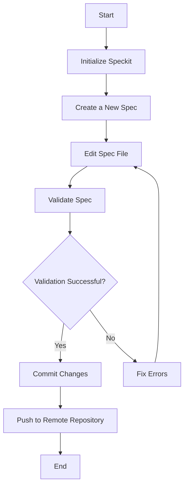

# Speckit Command Flow

Below is a Mermaid diagram that illustrates the flow of Speckit commands:

This diagram provides a high-level overview of the typical workflow when using Speckit commands. For more details, refer to the [Speckit Documentation](https://github.com/schalkje/devman/blob/main/speckit/speckit.md).